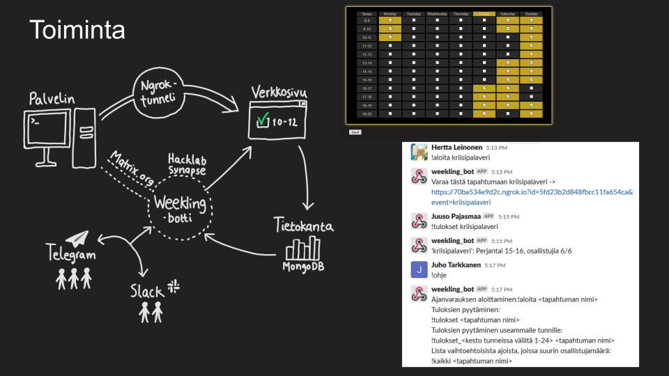

# weekling_botti
[Matrix](https://matrix.org/) -protokollaa hyödyntävä pikaviestimissä käytettävä botti yhteisen tapaamisajan etsimiseen.
<br/><br/>


## Käyttämiseen

### Botin ajaminen
Debian:
```
sudo apt install python3-pip
sudo pip3 install pipenv
# Käynnistykseen:
pipenv shell
pipenv install # 1. kerralla
python3 bot.py
```

### Web-sivun repositorio
https://github.com/elsilv/weekling-web/
